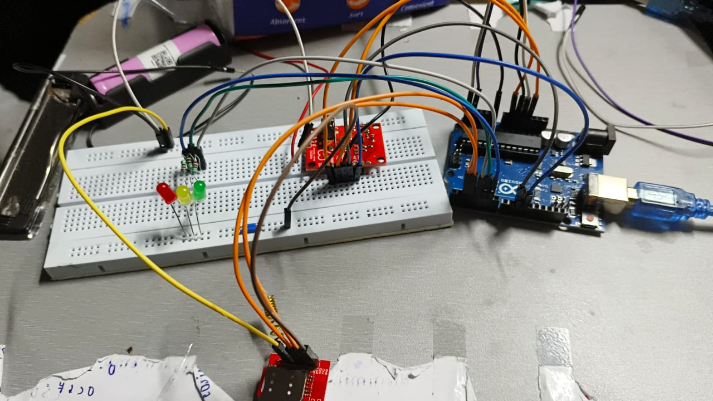
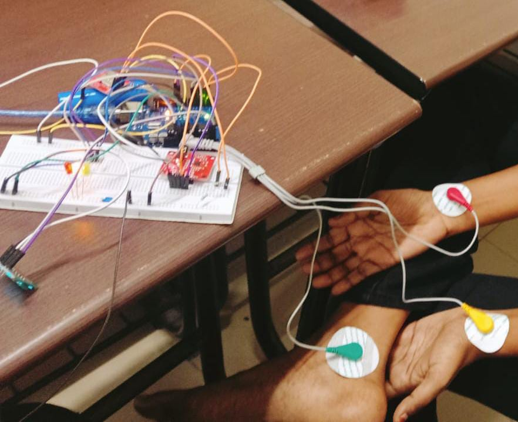
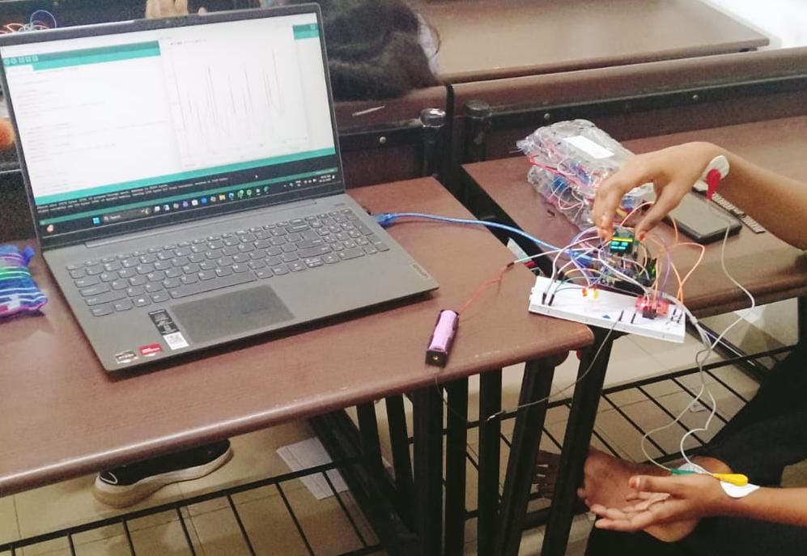
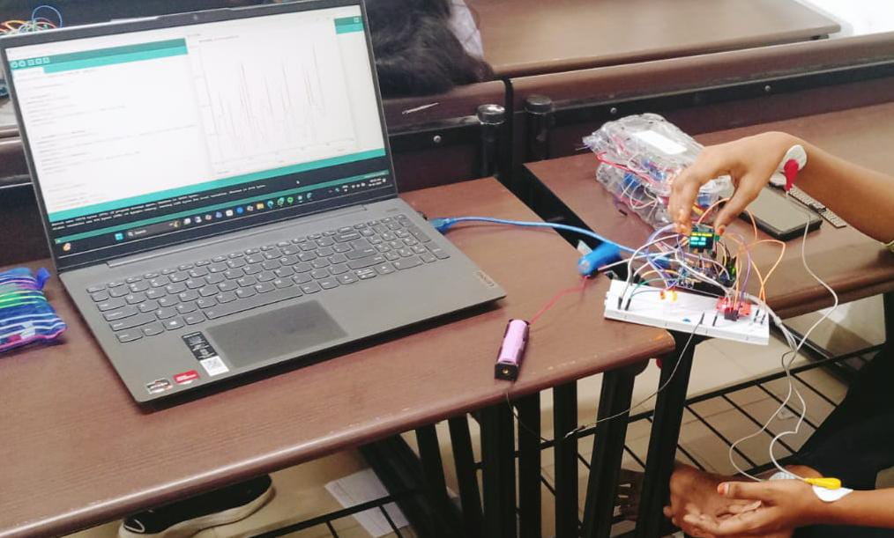
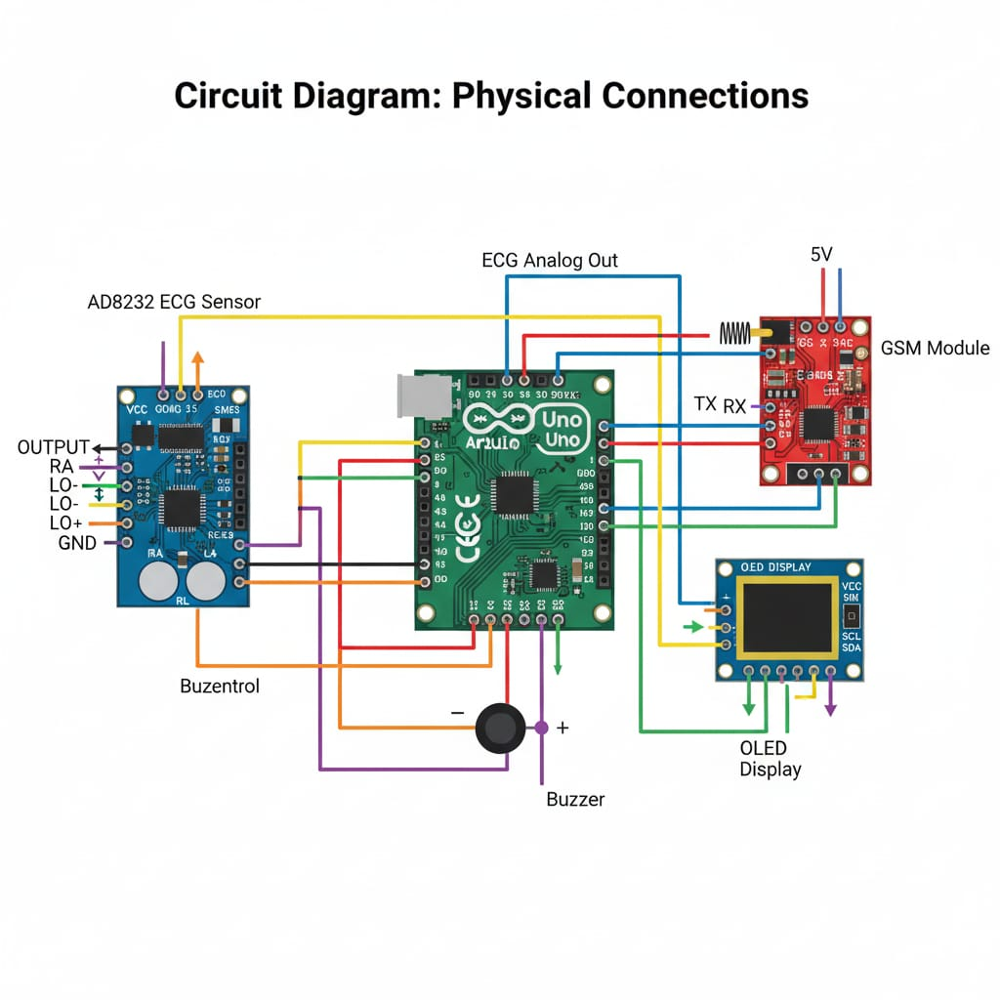

## Pulse_of_Pressure_Real-Time_Stress_Monitoring
This project presents a real‑time biomedical monitoring system that listens to the heart’s rhythm, interprets stress levels, and communicates alerts intelligently. Using an Arduino Uno and AD8232 ECG sensor, the system captures the heart’s electrical activity, filters and processes the signal, calculates beats per minute (BPM), and classifies stress levels as low, medium, or high. When stress exceeds safe limits, it instantly triggers visual indicators and sends an SMS alert through a GSM module, making it a compact, responsive health companion.

## System Overview:
The setup integrates multiple modules to form a seamless health‑monitoring loop:AD8232 ECG Module acquires and conditions the heart signal through electrodes (RA, LA, RL).
Arduino Uno performs signal filtering (moving average), peak detection (R‑wave identification), and BPM computation using time intervals.
OLED Display (SSD1306) shows real‑time BPM and stress level.
LEDs (Green, Yellow, Red) provide quick visual feedback for stress intensity.
GSM Module (SIM800L) sends SMS alerts when stress is high.

Connections are simple yet efficient — ECG output to A0, OLED via I²C (A4, A5), GSM on pins D7–D8, and LEDs on D4–D6.

## Core Concepts:
This project combines biomedical signal processing and embedded systems programming, applying:
Electrocardiography (ECG)
Analog signal acquisition and conditioning
Moving average filtering
Peak detection and BPM calculation
GSM communication using AT commands

## Software Implementation:
Developed on Arduino IDE using Embedded C/C++, the code employs:
Adafruit_SSD1306 and Adafruit_GFX for OLED graphics
SoftwareSerial for GSM communication
The algorithm continuously reads ECG data, smooths it, detects peaks, computes BPM, and classifies stress:
LOW: BPM < 60 → Calm state
MEDIUM: 60 ≤ BPM ≤ 100 → Normal activity
HIGH: BPM > 100 → Stress alert

## Output & Visualization:
The system provides dual visualization:serial monitor and serial plotter.
Serial Plotter: Displays a cyan ECG waveform with BPM and stress indicators (yellow and red text).
Serial Monitor: Shows live readings. This output mirrors real‑time data streaming from the Arduino, confirming accurate signal processing and alert functionality.

## Output Images:

## Alert Mechanism:
High Stress (BPM > 100): Red LED + SMS alert
Medium Stress (60–100 BPM): Yellow LED
Low Stress (< 60 BPM): Green LED

## Skills Gained:
Embedded systems design
Biomedical signal analysis
Sensor integration and calibration
GSM communication and debugging
Real‑time data visualization

## Applications:
Personal health and stress monitoring
Early cardiac anomaly detection
Wearable wellness devices
Remote patient observation

## Challenges & Limitations:
ECG noise due to movement or poor electrode contact
BPM‑based stress classification (basic model)
GSM power stability issues

## Future Scope:
IoT cloud connectivity for remote dashboards
Mobile app integration
AI‑based stress prediction models
Wearable ECG prototypes with advanced filtering

## Team V VAISHNAVI
Institution: Vellore Institute of Technology (VIT)

Support If you found this project inspiring, consider giving it a star on GitHub to support further development and encourage open-source innovation.

